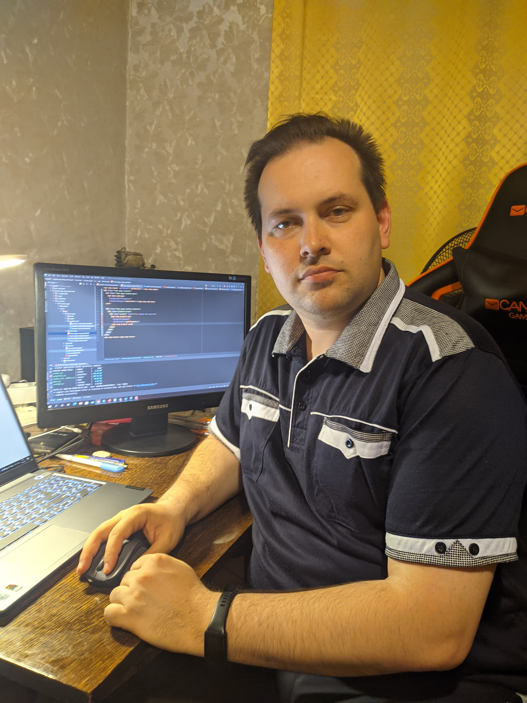
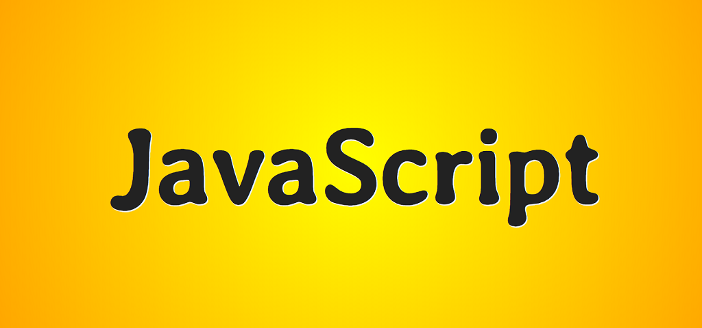
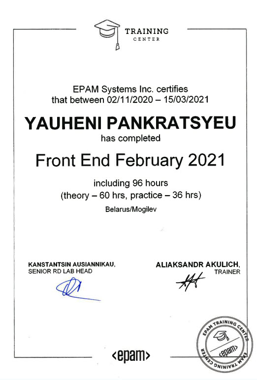
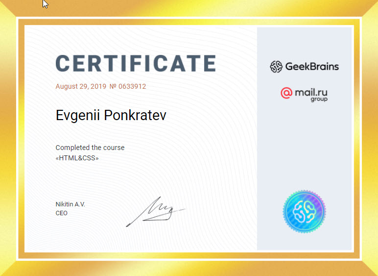

# YAUHENI PANKRATSYEU

## Contact Info
|Type of contact|Data|
|-----:|:------|
|MTS (Viber, Telegram):|*+375295465422*|
|A1:|*+375297337462*|
|Discord:|*shinoby85*|
|Skype:|*jshinoby*|

[][1][][2][][3]

## Summary
I work for BTI as a C# developer, but I like FrontEnd. I did my first job in 2020 (web page). It was homework for the GeekBrains courses, and it was awesome. Today I have a goal improve my skills with EPAM Training Center. I want to work for big company.

## Skills

|My skils|Level (0-9)|
|----:|:----:|
|HTML/CSS|8|
|JavaScript|8|
|Git|8|
|C#|6|

## Experience

:star2: HTML/CSS (Suits & Landing pages)
  * CoralWater (my first project) ***[Link](https://zhenya85.github.io/coralwater/)***
  * GBLanding  ***[Link](https://zhenya85.github.io/GBLanding/)***
  * Usance  ***[Link](https://zhenya85.github.io/Usance/)***
  * Stimulus  ***[Link](https://zhenya85.github.io/stimulus/)***
  * HistoricalGames  ***[Link](https://zhenya85.github.io/HistoricalGames/)***
  * OrganicFood  ***[Link](https://zhenya85.github.io/OrganicFood/)***
  * Snow (Epam project for training)  ***[Link](https://zhenya85.github.io/Snow/)***
  * Webdev (Rolling Scope project)   ***[Link](https://zhenya85.github.io/webdev/)***
  * Shelter (Rolling Scope project)   ***[Link](https://zhenya85.github.io/shelter/)***

:star2: JavaScript (practice)
  * Fastfood  ***[Link](https://zhenya85.github.io/Fastfood/)***
  * Snake (game)  ***[Link](https://zhenya85.github.io/Snake/)***
  * Calendar  ***[Link](https://zhenya85.github.io/Calendar/)***
  * Calculator (Rolling Scope project)   ***[Link](https://zhenya85.github.io/calculator/)***
  * Momentum (Rolling Scope project)   ***[Link](https://zhenya85.github.io/momentum/)***
  * Virtual Keyboard (Rolling Scope project)   ***[Link](https://zhenya85.github.io/virtual-keyboard/)***

:star2: Angular (practice)
  * Planer   ***[Link](https://shinoby85.github.io/newplaner/home)***

## Education

:mortar_board: Epam Training Center (11.2020-03.2021)

:mortar_board: GeekBrains courses
   - HTML/CSS (**_[certificate](https://geekbrains.ru/certificates/633912.en)_**)
   - HTML5/CSS3 (**_[certificate](https://geekbrains.ru/certificates/351259.en)_**)
   - JavaScript (**_[certificate](https://geekbrains.ru/certificates/788710.en)_**)
  
:mortar_board: ITStep courses

:mortar_board: English course by LangOffice

## English
A2

[1]:https://vk.com/eponk
[2]:https://www.facebook.com/profile.php?id=100000615839048
[3]:https://www.linkedin.com/in/yauheni-pankratsyeu-b172b5152/

<!--

### Hi there 👋

**shinoby85/shinoby85** is a ✨ _special_ ✨ repository because its `README.md` (this file) appears on your GitHub profile.

Here are some ideas to get you started:

- 🔭 I’m currently working on ...
- 🌱 I’m currently learning ...
- 👯 I’m looking to collaborate on ...
- 🤔 I’m looking for help with ...
- 💬 Ask me about ...
- 📫 How to reach me: ...
- 😄 Pronouns: ...
- ⚡ Fun fact: ...
-->

[ ] HTML
[ ] JavaScript
[ ] ReactJs
[ ] Angular
